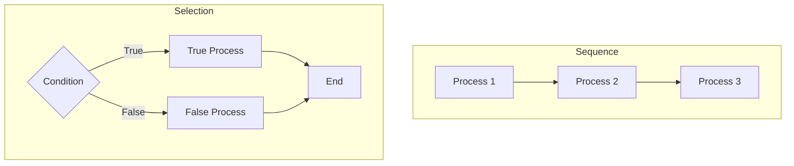
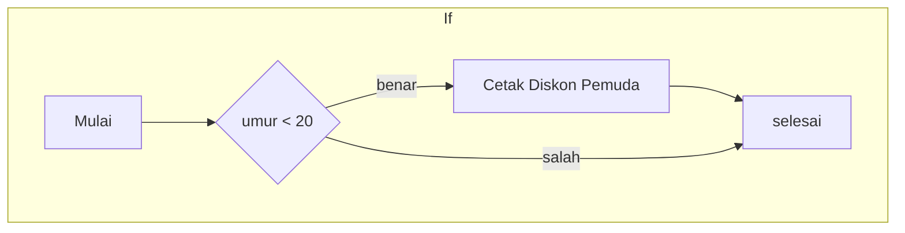
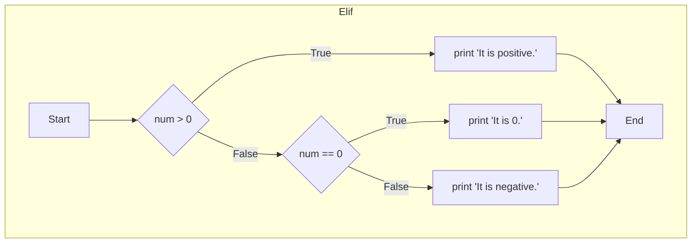

**Struktur Kontrol dalam Pemrograman**
================================================

Program Python yang telah kita tulis sejauh ini menggunakan struktur sekuensial, di mana kode yang ditulis terlebih dahulu akan dieksekusi terlebih dahulu. Struktur eksekusi sekuensial adalah struktur umum yang digunakan sebagian besar bahasa pemrograman, termasuk Python.

Namun, dalam bahasa pemrograman, kita tidak bisa selalu menggunakan aliran sekuensial. Perintah tertentu dapat dilakukan hanya ketika kondisi tertentu terpenuhi, atau tugas yang berbeda mungkin diperlukan tergantung pada kondisi.

Dalam unit ini, kita akan mempelajari pernyataan bersyarat untuk memecahkan masalah yang lebih kompleks. Untuk mengingat kembali mengenai control structures, terdapat 3 tipe control structures dalam bahasa pemrograman:

1. **Sequence**: Struktur di mana perintah dieksekusi secara berurutan.
2. **Selection**: Struktur di mana salah satu dari beberapa instruksi dipilih dan dieksekusi.
3. **Iteration**: Struktur di mana perintah yang sama dieksekusi berulang kali.

**Mengapa Kita Butuh  *Selection Structure*?**
-----------------------------------------

- Pada beberapa tahap program, ada lebih dari satu jalur yang harus dilalui, dan kita harus memilih satu. 
- Jika tidak ada struktur seleksi, program akan selalu mengulangi tindakan yang sama, dan jika program selalu melakukan hal yang sama, itu akan selalu mencapai kesimpulan yang tidak akan pernah berubah.


<br><br><br><br>

**If Statement Syntax**
-----------------------------------------

Sintaks yang digunakan apabila kita ingin menerapkan `if` statement pada Python:

```
if condition:
    # block of code
```

Agar lebih jelas tentang bagaimana cara untuk menggunakan `if` statement, berikut contoh penerapan dari `if` statement pada Python:

```python
age = 18  # diberikan kondisi bahwa age = 18

if age < 20:  # result dari age < 20 adalah True
    print('youth discount')
```

**Output:**
```
youth discount
```

Ketika nilai `age` adalah 18, pernyataan kondisional `age < 20` menjadi `True` atau `Benar`, sehingga `'youth discount'` tercetak di dalam program.

Ketika nilai `age` adalah 20 atau lebih, tidak ada keluaran yang ditampilkan.



<br><br><br><br>

# Indentation

Python adalah bahasa pemrograman dimana indentation adalah hal yang penting. Tergantung pada indentation, kode yang sama menghasilkan hasil yang berbeda. Hal ini sangat berbeda dengan bahasa pemrograman seperti C++ atau Java yang tidak mementingkan indentation karena mereka memiliki separator antara bagian program yang satu dengan yang lain menggunakan separator `;` dimana Python tidak memiliki hal tersebut.

Untuk lebih jelas mengenai indentation perhatikan kondisi berikut:

```python
1. Kondisi dimana if statement adalah True  
age = 18  
if age < 20:  
    print('youth discount')  
print('Welcome')  
# output 'youth discount'  
# output 'Welcome'

2. Kondisi dimana if statement adalah False  
age = 24  
if age < 20:  
    print('youth discount')  
print('Welcome')  
# output 'Welcome'
```

```python
3. Kondisi dimana if statement adalah False dan diberikan indentation
age = 24
if age < 20:
    print('Welcome')
    print('youth welcome')
    print('age', age)
    print('youth discount')
# no output
```

Pada contoh kode di atas, kode nomor 2 dan 3, kondisi `if` statement pada kedua contoh di atas adalah `False`, namun pada kode nomor 4, tidak ada output yang di tampilkan pada program karena `print('youth welcome')`, `print('age',age)`, dan `print('youth discount')` diberikan indentation, dimana pada kode nomor 2, 'Welcome' muncul di hasil program karena tidak diberikan indentation.


<br><br><br><br>

# Pass Keyword

`pass` keyword adalah built-in keyword dari Python yang cukup sering ditemui dalam program. `pass` statement adalah null statement. Perbedaan antara `pass` statement dan komentar adalah intrepreter tidak mengeksekusi kode yang merupakan komentar sementara intrepreter akan mengeksekusi `pass` namun tidak akan muncul pada output karena `pass` merupakan null statement.

`pass` digunakan ketika Anda ingin menulis blok kode seperti conditional, function, atau looping pada lain waktu karena eksekusi yang tepat dari blok kode tersebut belum dapat ditentukan. Contoh penerapan `pass` pada conditional statement:

```python
num = 2
if num % 2 == 0:
    print('Nomor genap')
if num % 3 == 0:
    pass

# output
Nomor genap
```

`pass` Statement Python juga dapat digunakan untuk mendefinisikan nama dari sebuah fungsi dan mengimplementasikan fungsionalitasnya nanti. Kita akan belajar tentang fungsi pada lesson berikutnya.

Fungsi `func` di bawah ini hanya mendefinisikan namanya dan bermaksud untuk mengimplementasikan fungsinya nanti.

```python
def func():
    pass

func()
```
<br><br><br><br>

# If-Else Statement

If-else statement berarti: "jika kondisinya benar maka jalankan pernyataan ini dan jika kondisinya tidak benar maka jalankan pernyataan yang lain".

Sebagai contoh untuk if-else statement, perhatikan kode berikut ini:

```python
# Contoh kode
if time < 12:
    print('It is morning')
else:
    print('It is afternoon')
```

Kondisi kode di atas juga disebut sebagai hubungan yang eksklusif, dimana pagi 'it is morning' dan siang 'it is afternoon' tidak bisa terjadi pada waktu yang bersamaan. Pernyataan if-else dapat digunakan untuk hubungan eksklusif tersebut.

Kondisi di atas juga bisa dibuat menggunakan 2 (dua) if statement, namun hal tersebut bukan implementasi yang terbaik karena menjadi kurang optimal.

```python
hour = 10  

if hour < 12:  
    print('It is morning.')  

if hour >= 12:  
    print('it is afternoon.')
```


<br><br><br><br>

# Elif Statement

Pertimbangkan sebuah program yang menerima bilangan bulat dari pengguna dan mencetak "Ini positif", "Ini 0", dan "Ini negatif".

Jika `True` dikembalikan dari pernyataan `if` pertama, baris kode dieksekusi dan keluar dari pernyataan kondisional.

Jika `False`, keputusan mungkin harus dibuat sesuai dengan ekspresi kondisional kedua.

Program dengan struktur seperti itu dapat dibangun menggunakan `if-elif-else`.

`elif` adalah singkatan dari `else if`.



Penggunaan `elif` diperuntukan untuk mempersingkat baris kode dan membuatnya lebih mudah dibaca dibanding harus menulis `else` dan `if` secara terpisah, berikut gambaran dari penggunaan `elif` vs `else` dan `if`:

```python
# Menggunakan else dan if
num = 0
if num > 0:
    print("Ini positif")
else:
    if num < 0:
        print("Ini negatif")
    else:
        print("Ini 0")

# Menggunakan elif
num = 0
if num > 0:
    print("Ini positif")
elif num < 0:
    print("Ini negatif")
else:
    print("Ini 0")
```

Kedua kondisi menghasilkan hasil yang sama, namun menggunakan `elif` lebih sederhana dan mengurangi jumlah baris kode.


<br><br><br><br>


## Nested Conditional Statement

If dan else statement juga dapat disusun sebagai nested if-else statement seperti kode di bawah ini:

```python
num = -100
if num < 0:
    print(num, 'adalah bilangan negatif. ')
else:
    print(num, 'adalah bukan bilangan negatif ')
    if num % 2 == 0:
        print(num, 'adalah bilangan genap')
    else:
        print(num, 'adalah bilangan ganjil')
        #output 
        #-100 adalah bilangan negatif 
```


Dalam kode di atas, `if-else` digunakan dua kali. Pernyataan `if-else` di luar disebut pernyataan `outer if-else`, dan pernyataan `if-else` di dalam disebut pernyataan `inner if-else`.

Pernyataan `if-else` ganda dapat terjadi dalam situasi di mana kondisi spesifik memerlukan verifikasi tambahan setelah `True` atau `False` dikembalikan untuk kondisi pertama. Sehingga dalam kode di atas, langkah validasi pertama adalah mengecek apakah angka tersebut adalah angka negatif `<0` atau positif `>0` dan kemudian validasi kedua adalah jika angka tersebut adalah positif, apakah nomor itu ganjil atau genap, sehingga diperlukan `if` dan `else` yang kedua.
